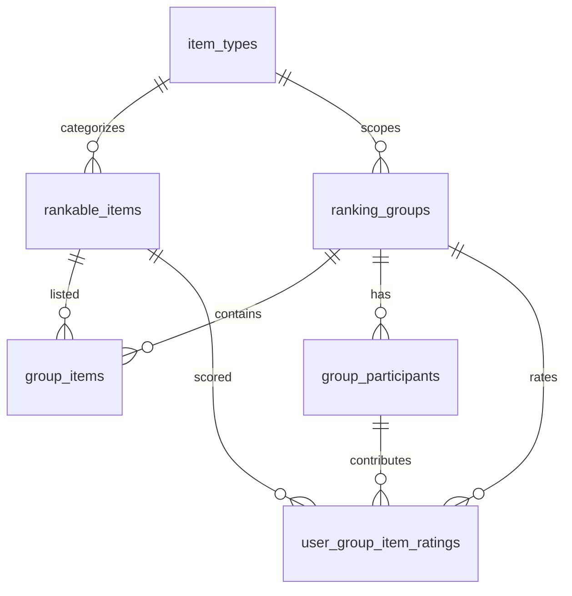

# Ranking Database Schema

This document describes the database objects that power shared Elo rankings for arbitrary item types. The schema is designed
for PostgreSQL (and Supabase) and is applied by the migration located at
`./supabase/migrations/20240509000000_create_ranking_schema.sql`.

## Overview

The schema introduces a generalized workflow:

1. **Item Types** (`item_types`) capture each category of content that can be ranked (movies, books, albums, etc.).
2. **Rankable Items** (`rankable_items`) store the canonical information for every item that could appear in a ranking.
3. **Ranking Groups** (`ranking_groups`) represent user-created collections that scope Elo comparisons to a single item type.
4. **Group Items** (`group_items`) enumerate the items assigned to a particular ranking group.
5. **Group Participants** (`group_participants`) track membership so the application knows which users can submit comparisons.
6. **User Group Item Ratings** (`user_group_item_ratings`) store the Elo score each participant has built up for every item in a
   group.

The diagram below summarizes the relationships:



> **Note:** User identifiers (`creator_id`, `user_id`) reference your external authentication system. They are stored as UUIDs
> so they can map directly to Supabase Auth users.

## Table reference

### `item_types`

| Column | Type | Notes |
| --- | --- | --- |
| `id` | `serial` | Surrogate primary key. |
| `name` | `varchar(255)` | Human-readable label. Must be unique. |
| `slug` | `varchar(255)` | URL-safe identifier (lowercase with hyphens recommended). Must be unique. |

### `rankable_items`

| Column | Type | Notes |
| --- | --- | --- |
| `id` | `serial` | Surrogate primary key. |
| `item_type_id` | `integer` | Foreign key to `item_types.id` with `ON DELETE RESTRICT`. |
| `external_id` | `varchar(255)` | Optional unique identifier from a third-party API. |
| `name` | `varchar(255)` | Display name for the item. |
| `image_path` | `varchar(1024)` | Optional relative or absolute path to artwork. |
| `metadata` | `jsonb` | Optional JSON payload for additional structured attributes. |

An index on `item_type_id` accelerates lookups when pulling all items for a given category.

### `ranking_groups`

| Column | Type | Notes |
| --- | --- | --- |
| `id` | `uuid` | Primary key generated with `gen_random_uuid()`. |
| `name` | `varchar(255)` | Required name of the group. |
| `description` | `text` | Optional long-form explanation shown to participants. |
| `creator_id` | `uuid` | References the creating user in the external auth system. |
| `item_type_id` | `integer` | Foreign key to `item_types.id` with `ON DELETE RESTRICT`. |
| `created_at` | `timestamptz` | Defaults to the current UTC timestamp. |

### `group_items`

| Column | Type | Notes |
| --- | --- | --- |
| `group_id` | `uuid` | Foreign key to `ranking_groups.id` with `ON DELETE CASCADE`. |
| `item_id` | `integer` | Foreign key to `rankable_items.id` with `ON DELETE CASCADE`. |

The composite primary key `(group_id, item_id)` ensures that items are listed only once per group.

### `group_participants`

| Column | Type | Notes |
| --- | --- | --- |
| `user_id` | `uuid` | Identifier for the participant in the external auth system. |
| `group_id` | `uuid` | Foreign key to `ranking_groups.id` with `ON DELETE CASCADE`. |
| `joined_at` | `timestamptz` | Defaults to the current UTC timestamp. |

The composite primary key `(user_id, group_id)` prevents duplicate memberships.

### `user_group_item_ratings`

| Column | Type | Notes |
| --- | --- | --- |
| `user_id` | `uuid` | Participant identifier. |
| `group_id` | `uuid` | Foreign key to `ranking_groups.id` with `ON DELETE CASCADE`. |
| `item_id` | `integer` | Foreign key to `rankable_items.id` with `ON DELETE CASCADE`. |
| `rating` | `numeric(10,4)` | Elo rating maintained per user/group/item trio. |
| `comparison_count` | `integer` | Number of comparisons made; defaults to `0`. |

Additional indexes on `group_id` and `item_id` support aggregate queries (e.g., leaderboards) without requiring a table scan.

## Applying the migration

Run the migration against your PostgreSQL database (or Supabase project) using your preferred tooling. With `psql` the command
looks like:

```bash
psql "$DATABASE_URL" -f supabase/migrations/20240509000000_create_ranking_schema.sql
```

After running the script you can verify the schema by inspecting the tables listed above.
